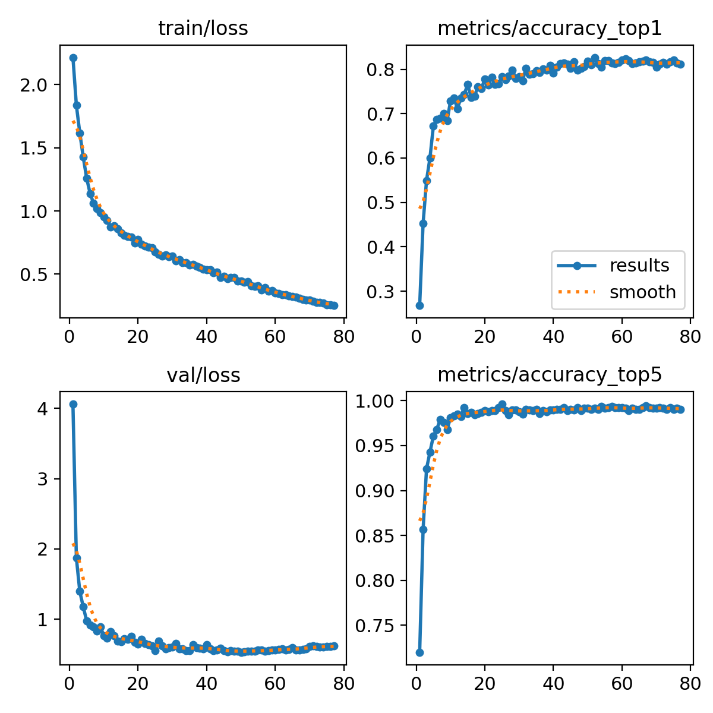
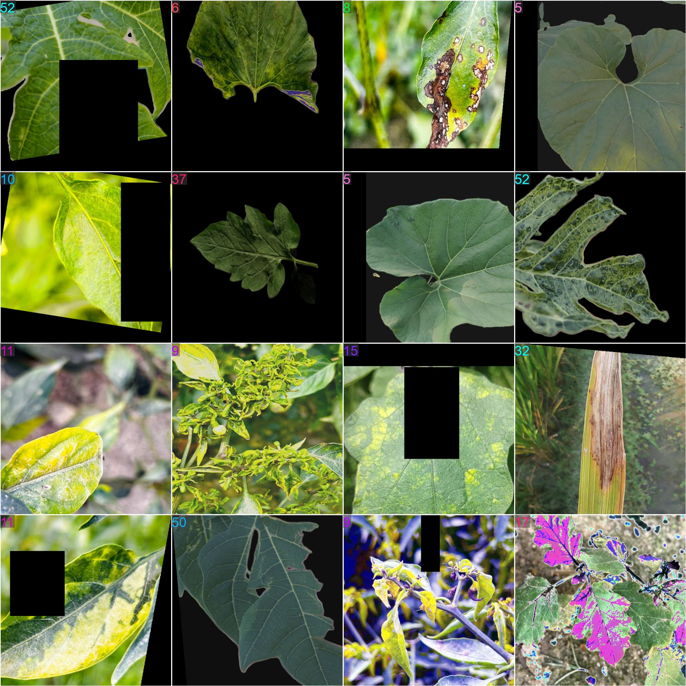
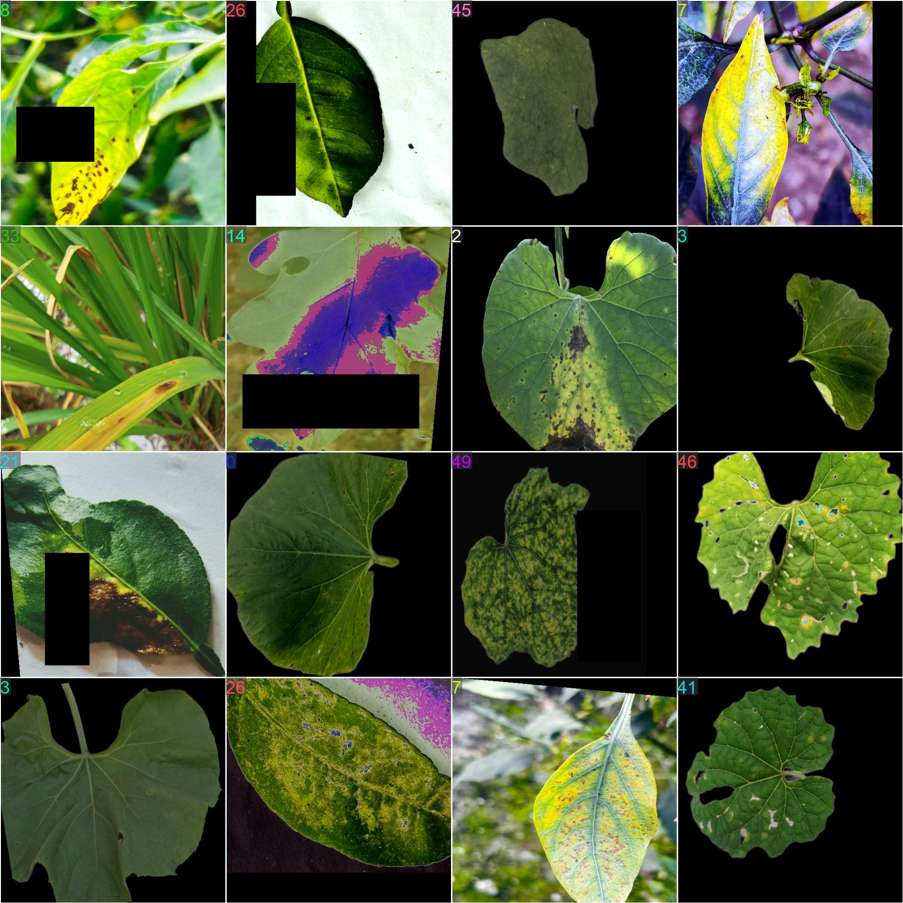
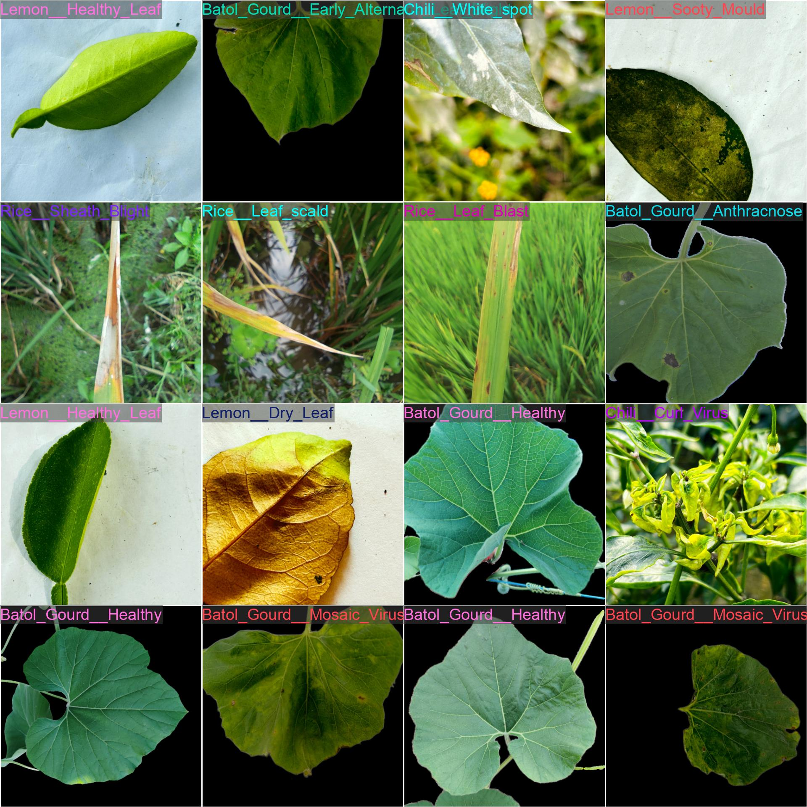
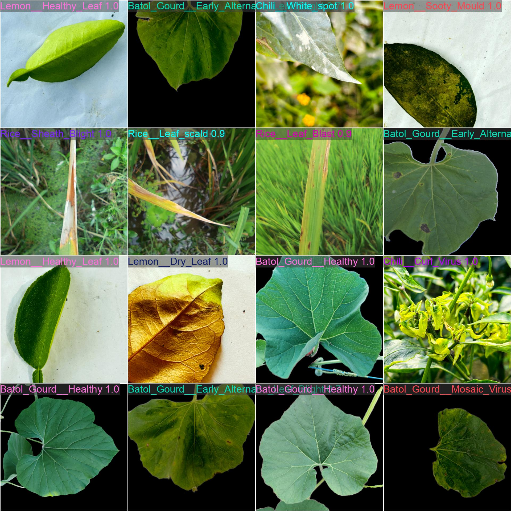
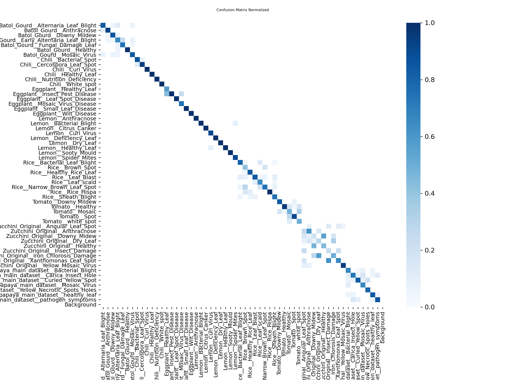

<p align="center">
  
  
  
  
  
  
</p>

# 🌿 Leaf Disease Classification with YOLO26

**A multi-crop plant disease classification system trained on the AgriVision dataset using the Ultralytics YOLO26 architecture.** This model identifies **57 disease and healthy classes** across **8 crop types**, achieving **82.7% top-1 accuracy** on the validation set and **79.9% overall accuracy** on the held-out test set across 10,727 images.

---

## 📑 Table of Contents

- [Overview](#overview)
- [Architecture](#architecture)
- [Dataset — AgriVision](#dataset--agrivision)
- [Training Configuration](#training-configuration)
- [Results & Evaluation](#results--evaluation)
- [Model Weights](#model-weights)
- [Installation & Quick Start](#installation--quick-start)
- [Inference Guide](#inference-guide)
- [ONNX Deployment](#onnx-deployment)
- [Project Structure](#project-structure)
- [Limitations & Future Work](#limitations--future-work)
- [Citation](#citation)
- [License](#license)

---

## Overview

Crop diseases cause billions of dollars in agricultural losses annually. Early and accurate identification is critical for timely intervention. This project presents a **lightweight, real-time leaf disease classification pipeline** built on the [Ultralytics YOLO26](https://docs.ultralytics.com/) nano classification backbone (`yolo26n-cls`), designed for edge deployment on mobile and embedded devices.

### Key Highlights

| Feature | Details |
|---|---|
| **Model** | YOLO26n-cls (nano classification variant) |
| **Task** | Multi-class image classification (57 classes) |
| **Crops Covered** | Batol Gourd, Chili, Eggplant, Lemon, Papaya, Rice, Tomato, Zucchini |
| **Dataset** | AgriVision — 10,727 images |
| **Best Val Top-1 Accuracy** | **82.7%** |
| **Best Val Top-5 Accuracy** | **99.4%** |
| **Test Accuracy** | **79.9%** (weighted F1: 0.80) |
| **Export Formats** | PyTorch (`.pt`) · ONNX (`.onnx`) |

---

## Architecture

The model utilizes **YOLO26n-cls**, a nano-scale classification backbone from the Ultralytics YOLO26 family. It is optimized for:

- **Low latency** inference on edge devices
- **Small model footprint** suitable for mobile and IoT deployment
- **High throughput** classification with competitive accuracy

The classification head replaces the detection head of the standard YOLO26 object detector, producing a probability distribution over 57 disease/healthy classes.

---

## Dataset — AgriVision

The **AgriVision Multi-Crop Plant Disease Dataset** is a curated collection of 10,727 leaf images spanning 8 crops and 57 classes. All images are organized into `train / val / test` splits under a flat class-folder structure compatible with Ultralytics YOLO.

### Dataset Summary

| Property | Value |
|---|---|
| **Total Crops** | 8 |
| **Total Classes** | 57 |
| **Total Images** | 10,727 |
| **Train Split** | ~80% (8,377 images) |
| **Validation Split** | ~10% (1,068 images) |
| **Test Split** | ~10% (1,282 images) |
| **Split Strategy** | Stratified random (seed=42); Rice uses original pre-split |

### Folder Structure

```
AgriVision_Split/
├── train/
│   ├── Batol_Gourd__Alternaria_Leaf_Blight/
│   ├── Chili__Curl_Virus/
│   ├── Lemon__Healthy_Leaf/
│   ├── Rice__Leaf_Blast/
│   └── ... (57 class folders)
├── val/
│   └── ... (57 class folders)
└── test/
    └── ... (51 class folders)
```

> **Naming Convention:** `{Crop}__{Disease}` — double underscore separates crop name from disease label.

### Crop-wise Distribution

| Crop | Classes | Images | Notes |
|---|---|---|---|
| **Batol Gourd** | 7 | 1,659 | Stratified 80/10/10 split |
| **Chili** | 6 | 1,856 | Stratified 80/10/10 split |
| **Lemon** | 9 | 1,354 | Stratified 80/10/10 split |
| **Papaya** | 7 | 1,684 | Stratified 80/10/10 split |
| **Rice** | 8 | 1,886 | Pre-split ([Mendeley Data](https://data.mendeley.com/datasets/hx6f852hw4/1)) |
| **Tomato** | 5 | 916 | Stratified 80/10/10 split |
| **Zucchini** | 9 | 988 | Stratified 80/10/10 split |
| **Eggplant** | 6 | 384 | Stratified 80/10/10 split |
| **Total** | **57** | **10,727** | |

### Complete Class List (57 Classes)

<details>
<summary>Click to expand full class list</summary>

| # | Class Name | Crop | Images |
|---|---|---|---|
| 1 | Batol_Gourd__Alternaria_Leaf_Blight | Batol Gourd | 304 |
| 2 | Batol_Gourd__Anthracnose | Batol Gourd | 276 |
| 3 | Batol_Gourd__Downy_Mildew | Batol Gourd | 286 |
| 4 | Batol_Gourd__Early_Alternaria_Leaf_Blight | Batol Gourd | 179 |
| 5 | Batol_Gourd__Fungal_Damage_Leaf | Batol Gourd | 39 |
| 6 | Batol_Gourd__Healthy | Batol Gourd | 260 |
| 7 | Batol_Gourd__Mosaic_Virus | Batol Gourd | 315 |
| 8 | Chili__Bacterial_Spot | Chili | 156 |
| 9 | Chili__Cercospora_Leaf_Spot | Chili | 180 |
| 10 | Chili__Curl_Virus | Chili | 423 |
| 11 | Chili__Healthy_Leaf | Chili | 458 |
| 12 | Chili__Nutrition_Deficiency | Chili | 444 |
| 13 | Chili__White_spot | Chili | 195 |
| 14 | Eggplant__Healthy_Leaf | Eggplant | 67 |
| 15 | Eggplant__Insect_Pest_Disease | Eggplant | 94 |
| 16 | Eggplant__Leaf_Spot_Disease | Eggplant | 111 |
| 17 | Eggplant__Mosaic_Virus_Disease | Eggplant | 36 |
| 18 | Eggplant__Small_Leaf_Disease | Eggplant | 14 |
| 19 | Eggplant__Wilt_Disease | Eggplant | 62 |
| 20 | Lemon__Anthracnose | Lemon | 100 |
| 21 | Lemon__Bacterial_Blight | Lemon | 105 |
| 22 | Lemon__Citrus_Canker | Lemon | 178 |
| 23 | Lemon__Curl_Virus | Lemon | 115 |
| 24 | Lemon__Deficiency_Leaf | Lemon | 193 |
| 25 | Lemon__Dry_Leaf | Lemon | 186 |
| 26 | Lemon__Healthy_Leaf | Lemon | 210 |
| 27 | Lemon__Sooty_Mould | Lemon | 153 |
| 28 | Lemon__Spider_Mites | Lemon | 114 |
| 29 | papaya_main_dataset__Bacterial_Blight | Papaya | 183 |
| 30 | papaya_main_dataset__Carica_Insect_Hole | Papaya | 318 |
| 31 | papaya_main_dataset__Curled_Yellow_Spot | Papaya | 538 |
| 32 | papaya_main_dataset__healthy_leaf | Papaya | 189 |
| 33 | papaya_main_dataset__Mosaic_Virus | Papaya | 119 |
| 34 | papaya_main_dataset__pathogen_symptoms | Papaya | 286 |
| 35 | papaya_main_dataset__Yellow_Necrotic_Spots_Holes | Papaya | 51 |
| 36 | Rice__Bacterial_Leaf_Blight | Rice | 208 |
| 37 | Rice__Brown_Spot | Rice | 274 |
| 38 | Rice__Healthy_Rice_Leaf | Rice | 187 |
| 39 | Rice__Leaf_Blast | Rice | 310 |
| 40 | Rice__Leaf_scald | Rice | 231 |
| 41 | Rice__Narrow_Brown_Leaf_Spot | Rice | 163 |
| 42 | Rice__Rice_Hispa | Rice | 225 |
| 43 | Rice__Sheath_Blight | Rice | 288 |
| 44 | Tomato__Downy Mildew | Tomato | 57 |
| 45 | Tomato__Healthy | Tomato | 288 |
| 46 | Tomato__Mosaic | Tomato | 195 |
| 47 | Tomato__Spot | Tomato | 311 |
| 48 | Tomato__white_spot | Tomato | 65 |
| 49 | Zucchini_Original__Angular_Leaf_Spot | Zucchini | 120 |
| 50 | Zucchini_Original__Anthracnose | Zucchini | 129 |
| 51 | Zucchini_Original__Downy_Midew | Zucchini | 153 |
| 52 | Zucchini_Original__Dry_Leaf | Zucchini | 67 |
| 53 | Zucchini_Original__Healthy | Zucchini | 88 |
| 54 | Zucchini_Original__Insect_Damage | Zucchini | 78 |
| 55 | Zucchini_Original__Iron_Chlorosis_Damage | Zucchini | 65 |
| 56 | Zucchini_Original__Xanthomonas_Leaf_Spot | Zucchini | 86 |
| 57 | Zucchini_Original__Yellow_Mosaic_Virus | Zucchini | 202 |

</details>

---

## Training Configuration

Training was performed using the Ultralytics YOLO framework with the following hyperparameters:

| Parameter | Value |
|---|---|
| **Base Model** | `yolo26n-cls.pt` (pretrained) |
| **Epochs** | 100 |
| **Image Size** | 512 × 512 |
| **Batch Size** | 16 |
| **Optimizer** | AdamW |
| **Initial Learning Rate** | 0.01 |
| **Final Learning Rate** | 0.01 (cosine schedule) |
| **Cosine LR Scheduler** | Enabled |
| **Weight Decay** | 0.0005 |
| **Warmup Epochs** | 3.0 |
| **Patience (Early Stop)** | 25 epochs |
| **AMP (Mixed Precision)** | Enabled |
| **Augmentation** | Enabled (`augment=True`) |
| **HSV-H / S / V** | 0.015 / 0.7 / 0.4 |
| **Flip LR** | 0.5 |
| **Scale** | 0.5 |
| **Translate** | 0.1 |
| **Mosaic** | 1.0 |
| **Erasing** | 0.4 |
| **Auto Augment** | RandAugment |
| **Device** | GPU (`device=0`) |
| **Workers** | 8 |
| **Deterministic** | Yes (seed=0) |
| **Checkpoint Interval** | Every 10 epochs |

### Training Command

```bash
yolo classify train \
  model=yolo26n-cls.pt \
  data=path/to/AgriVision_Split \
  epochs=100 \
  imgsz=512 \
  batch=16 \
  optimizer=AdamW \
  cos_lr=True \
  patience=25 \
  save_period=10 \
  augment=True \
  project=runs/local_train \
  name=57cls_first4
```

---

## Results & Evaluation

### Training Curves

The model was trained for **77 epochs** (early stopping triggered at patience=25 after best epoch ~52).

<p align="center">
  
</p>
<p align="center"><em>Figure 1 — Training loss, top-1 accuracy, top-5 accuracy, and validation loss over 77 epochs.</em></p>

### Performance Summary

| Metric | Validation Set | Test Set |
|---|---|---|
| **Top-1 Accuracy** | 82.7% | 79.9% |
| **Top-5 Accuracy** | 99.4% | — |
| **Weighted Precision** | — | 0.81 |
| **Weighted Recall** | — | 0.80 |
| **Weighted F1-Score** | — | 0.80 |
| **Macro F1-Score** | — | 0.75 |

### Prediction Grid (Test Set)

<p align="center">
  
</p>
<p align="center"><em>Figure 3 — Sample predictions on test images showing predicted vs. true labels.</em></p>

### Training Batch Samples

<p align="center">
  
  
</p>
<p align="center"><em>Figure 4 — Sample training batches with augmentation applied.</em></p>

### Validation Predictions vs. Ground Truth

<p align="center">
  
  
</p>
<p align="center"><em>Figure 5 — Validation batch: Ground truth labels (left) vs. model predictions (right).</em></p>

### Normalized Confusion Matrix (Validation)

<p align="center">
  
</p>
<p align="center"><em>Figure 6 — Normalized confusion matrix on the validation set.</em></p>

### Epoch-wise Results (Validation Set)

<p align="center">
  
</p>
<p align="center"><em>Figure 7 — Detailed training and validation metrics across all epochs.</em></p>

### Per-Class Performance (Test Set)

<details>
<summary>Click to expand full classification report</summary>

```
Overall Accuracy: 0.7988

                                                  precision    recall  f1-score   support

             Batol_Gourd__Alternaria_Leaf_Blight       0.80      0.77      0.79        31
                        Batol_Gourd__Anthracnose       0.85      0.82      0.84        28
                       Batol_Gourd__Downy_Mildew       0.96      0.83      0.89        29
       Batol_Gourd__Early_Alternaria_Leaf_Blight       0.78      0.78      0.78        18
                 Batol_Gourd__Fungal_Damage_Leaf       0.50      0.50      0.50         4
                            Batol_Gourd__Healthy       1.00      0.96      0.98        26
                       Batol_Gourd__Mosaic_Virus       0.84      1.00      0.91        32
                           Chili__Bacterial_Spot       1.00      1.00      1.00        16
                     Chili__Cercospora_Leaf_Spot       1.00      1.00      1.00        18
                               Chili__Curl_Virus       1.00      1.00      1.00        43
                             Chili__Healthy_Leaf       0.98      1.00      0.99        46
                     Chili__Nutrition_Deficiency       1.00      1.00      1.00        45
                               Chili__White_spot       1.00      1.00      1.00        20
                          Eggplant__Healthy_Leaf       1.00      0.71      0.83         7
                   Eggplant__Insect_Pest_Disease       0.75      0.90      0.82        10
                     Eggplant__Leaf_Spot_Disease       1.00      0.92      0.96        12
                  Eggplant__Mosaic_Virus_Disease       1.00      1.00      1.00         4
                    Eggplant__Small_Leaf_Disease       0.67      1.00      0.80         2
                          Eggplant__Wilt_Disease       0.88      1.00      0.93         7
                              Lemon__Anthracnose       0.91      1.00      0.95        10
                         Lemon__Bacterial_Blight       1.00      1.00      1.00        11
                            Lemon__Citrus_Canker       1.00      1.00      1.00        18
                               Lemon__Curl_Virus       1.00      0.92      0.96        12
                          Lemon__Deficiency_Leaf       1.00      1.00      1.00        20
                                 Lemon__Dry_Leaf       1.00      1.00      1.00        19
                             Lemon__Healthy_Leaf       1.00      1.00      1.00        21
                              Lemon__Sooty_Mould       1.00      1.00      1.00        16
                             Lemon__Spider_Mites       1.00      1.00      1.00        12
                     Rice__Bacterial_Leaf_Blight       0.64      0.81      0.72        42
                                Rice__Brown_Spot       0.74      0.51      0.60        55
                         Rice__Healthy_Rice_Leaf       0.97      0.86      0.91        37
                                Rice__Leaf_Blast       0.64      0.73      0.68        62
                                Rice__Leaf_scald       0.74      0.63      0.68        46
                    Rice__Narrow_Brown_Leaf_Spot       0.40      0.58      0.47        33
                                Rice__Rice_Hispa       0.93      0.93      0.93        45
                             Rice__Sheath_Blight       0.92      0.79      0.85        58
                            Tomato__Downy Mildew       0.50      0.67      0.57         6
                                 Tomato__Healthy       0.69      0.93      0.79        29
                                  Tomato__Mosaic       0.89      0.40      0.55        20
                                    Tomato__Spot       0.83      0.91      0.87        32
                              Tomato__white_spot       0.67      0.29      0.40         7
            Zucchini_Original__Angular_Leaf_Spot       0.29      0.17      0.21        12
                  Zucchini_Original__Anthracnose       0.31      0.31      0.31        13
                  Zucchini_Original__Downy_Midew       0.27      0.19      0.22        16
                     Zucchini_Original__Dry_Leaf       0.00      0.00      0.00         7
                      Zucchini_Original__Healthy       0.45      0.56      0.50         9
                Zucchini_Original__Insect_Damage       0.50      0.12      0.20         8
        Zucchini_Original__Iron_Chlorosis_Damage       0.08      0.14      0.10         7
        Zucchini_Original__Xanthomonas_Leaf_Spot       0.38      0.56      0.45         9
          Zucchini_Original__Yellow_Mosaic_Virus       0.70      1.00      0.82        21
           papaya_main_dataset__Bacterial_Blight       0.94      0.84      0.89        19
         papaya_main_dataset__Carica_Insect_Hole       0.61      0.62      0.62        32
         papaya_main_dataset__Curled_Yellow_Spot       0.85      0.85      0.85        54
               papaya_main_dataset__Mosaic_Virus       0.56      0.42      0.48        12
papaya_main_dataset__Yellow_Necrotic_Spots_Holes       1.00      0.50      0.67         6
               papaya_main_dataset__healthy_leaf       0.77      0.89      0.83        19
          papaya_main_dataset__pathogen_symptoms       0.67      0.76      0.71        29

                                        accuracy                           0.80      1282
                                       macro avg       0.77      0.76      0.75      1282
                                    weighted avg       0.81      0.80      0.80      1282
```

</details>

### Best Performing Crops (Test Set)

| Crop | Avg F1-Score | Highlights |
|---|---|---|
| **Chili** | **1.00** | Perfect classification across all 6 classes |
| **Lemon** | **0.99** | Near-perfect; only minor confusion on Anthracnose/Curl Virus |
| **Eggplant** | **0.89** | Strong despite smallest dataset (384 images) |
| **Batol Gourd** | **0.81** | Solid performance; Fungal Damage (39 imgs) is weakest |
| **Rice** | **0.73** | Harder task — visually similar fungal/bacterial symptoms |
| **Papaya** | **0.72** | Mosaic Virus & Necrotic Spots challenging (low sample count) |
| **Tomato** | **0.64** | Downy Mildew & White Spot suffer from < 65 images each |
| **Zucchini** | **0.31** | Most challenging — high inter-class similarity, small dataset |

---

## Model Weights

| File | Description | Size |
|---|---|---|
| `best.pt` | Best PyTorch checkpoint (highest val accuracy) | — |
| `best.onnx` | ONNX exported model for cross-platform deployment | — |

Intermediate checkpoints (every 10 epochs) are available in the training run directory for ablation studies.

---

## Installation & Quick Start

### Prerequisites

- Python ≥ 3.8
- CUDA-compatible GPU (recommended) or CPU
- pip / conda

### Setup

```bash
# Clone the repository
git clone https://github.com/Raiyankhan640/Leaf-Disease-Classification-YOLO26.git
cd Leaf-Disease-Classification-YOLO26

# Install dependencies
pip install ultralytics>=8.3.0 onnxruntime opencv-python numpy pillow
```

### Verify Installation

```python
from ultralytics import YOLO

model = YOLO("best.pt")
print(model.info())
```

---

## Inference Guide

### Single Image Prediction

```python
from ultralytics import YOLO

# Load the trained model
model = YOLO("best.pt")

# Run inference on a single image
results = model.predict(
    source="path/to/leaf_image.jpg",
    imgsz=512,
    conf=0.25
)

# Parse results
for result in results:
    top5_indices = result.probs.top5        # Top-5 class indices
    top5_conf = result.probs.top5conf       # Top-5 confidences
    predicted_class = result.names[top5_indices[0]]
    confidence = top5_conf[0].item()
    print(f"Predicted: {predicted_class} ({confidence:.2%})")
```

### Batch Inference on a Directory

```python
from ultralytics import YOLO

model = YOLO("best.pt")

# Predict on all images in a folder
results = model.predict(
    source="path/to/test_images/",
    imgsz=512,
    save=True,
    project="results",
    name="predictions"
)
```

### CLI Inference

```bash
# Single image
yolo classify predict model=best.pt source=path/to/leaf_image.jpg imgsz=512

# Directory of images
yolo classify predict model=best.pt source=path/to/test_images/ imgsz=512 save=True

# Using webcam / video
yolo classify predict model=best.pt source=0 imgsz=512 show=True
```

### Model Validation

```bash
# Validate on the test set
yolo classify val model=best.pt data=path/to/AgriVision_Split split=test imgsz=512
```

---

## ONNX Deployment

The model is exported to ONNX format for cross-platform deployment (TensorRT, OpenVINO, CoreML, ONNX Runtime, etc.).

### Export to ONNX

```bash
yolo export model=best.pt format=onnx imgsz=512 simplify=True
```

### ONNX Runtime Inference

```python
import onnxruntime as ort
import numpy as np
from PIL import Image

# Load ONNX model
session = ort.InferenceSession("best.onnx")
input_name = session.get_inputs()[0].name

# Preprocess image
img = Image.open("path/to/leaf_image.jpg").resize((512, 512))
img_array = np.array(img).astype(np.float32) / 255.0
img_array = np.transpose(img_array, (2, 0, 1))  # HWC -> CHW
img_array = np.expand_dims(img_array, axis=0)     # Add batch dim

# Run inference
outputs = session.run(None, {input_name: img_array})
predictions = outputs[0][0]

# Get predicted class
class_id = np.argmax(predictions)
confidence = predictions[class_id]
print(f"Class ID: {class_id}, Confidence: {confidence:.4f}")
```

---

## Project Structure

```
Leaf-Disease-Classification-YOLO26/
│
├── README.md                          # This documentation
├── data_report.md                     # Detailed dataset description
├── best.pt                            # Best model weights (PyTorch)
├── best.onnx                          # Best model weights (ONNX)
│
├── Reports/
│   └── baseline-100ep/
│       ├── classification_report.txt  # Per-class precision/recall/F1 on test set
│       ├── f1_classes.txt             # F1 scores by class
│       ├── test_confusion_matrix.png  # Confusion matrix on test set
│       ├── prediction_grid.png        # Sample prediction visualization
│       └── results.png               # Training & validation curves
│
└── Runs/
    └── classify/runs/local_train/
        └── 57cls_first4/
            ├── args.yaml              # Full training configuration
            ├── results.csv            # Epoch-wise metrics log
            ├── results.png            # Training curves plot
            ├── confusion_matrix.png   # Validation confusion matrix
            ├── confusion_matrix_normalized.png
            ├── train_batch*.jpg       # Sample training batches
            ├── val_batch*_labels.jpg  # Validation ground truth
            ├── val_batch*_pred.jpg    # Validation predictions
            └── weights/
                ├── best.pt            # Best checkpoint
                ├── best.onnx          # ONNX export
                ├── last.pt            # Last epoch checkpoint
                └── epoch*.pt          # Periodic checkpoints
```

---

## Limitations & Future Work

### Current Limitations

- **Zucchini classes** show low F1-scores (avg 0.31) due to high visual similarity between diseases and limited training data (988 images across 9 classes).
- **Minority classes** (< 65 images) such as `Batol_Gourd__Fungal_Damage_Leaf`, `Tomato__Downy_Mildew`, `Tomato__white_spot`, and `papaya_main_dataset__Yellow_Necrotic_Spots_Holes` have lower performance.
- **Rice diseases** exhibit moderate confusion between visually similar fungal and bacterial symptoms.

### Future Directions

- **Data augmentation & oversampling** for under-represented classes
- **Larger model variants** (YOLO26s-cls, YOLO26m-cls) for improved accuracy
- **Knowledge distillation** from larger teacher models
- **Attention mechanisms** for fine-grained disease differentiation
- **Grad-CAM visualizations** for model interpretability
- **Mobile deployment** via TensorRT / CoreML / TFLite conversion
- **Multi-label classification** for co-occurring diseases
- **Expanding crop coverage** with additional species and disease types

---

## Citation

If you use this work in your research, please cite:

```bibtex
@misc{leaf-disease-yolo26-2026,
  title     = {Leaf Disease Classification with YOLO26: A Multi-Crop Plant Disease Identification System},
  author    = {Raiyan Khan},
  year      = {2026},
  url       = {https://github.com/Raiyankhan640/Leaf-Disease-Classification-YOLO26},
  note      = {Trained on AgriVision dataset (10,727 images, 57 classes, 8 crops)}
}
```

### Dataset References

- **Rice Leaf Disease Dataset:** Hasan, M.M. et al. — *Rice Leaf Bacterial and Fungal Disease Dataset* — [Mendeley Data](https://data.mendeley.com/datasets/hx6f852hw4/1)

---

## License

This project is released for **academic and research purposes**. Please refer to individual dataset licenses for commercial usage restrictions.

---

<p align="center">
  <b>Built with</b> <a href="https://docs.ultralytics.com/">Ultralytics YOLO</a> · <b>Dataset:</b> AgriVision Multi-Crop Plant Disease Dataset
</p>
