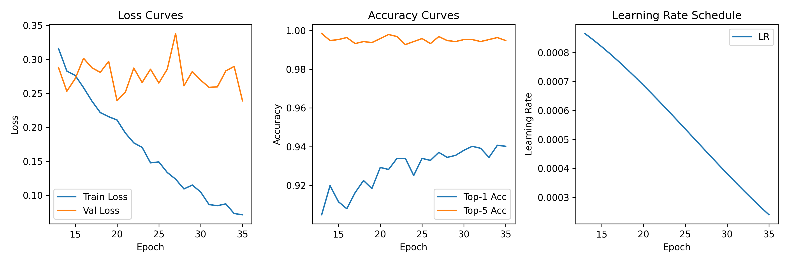
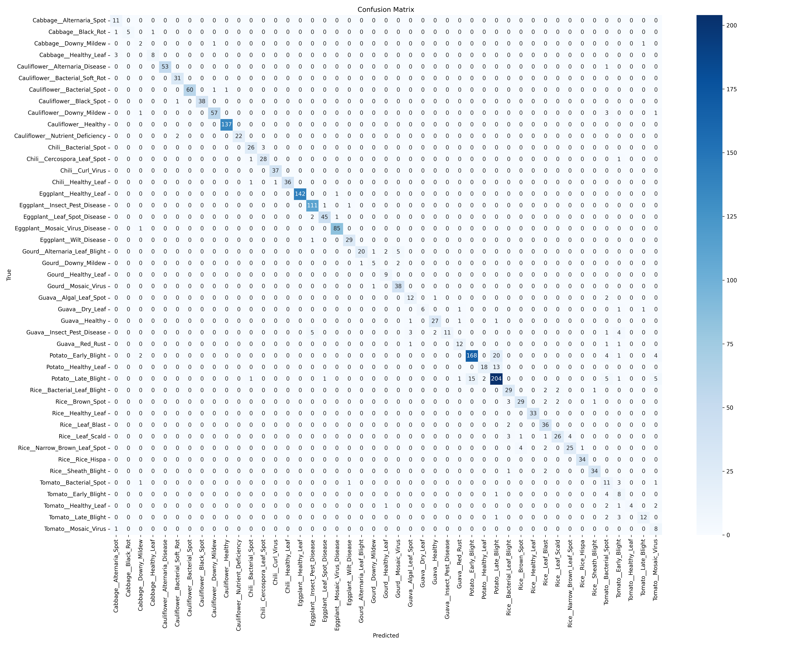

# 🌿 Multi-Crop Plant Disease Identification System

<div align="center">


<br/>

[](https://github.com/ultralytics/ultralytics)
[](results/overall_metrics.txt)
[](results/overall_metrics.txt)
[](results/per_class_accuracy.csv)
[](#supported-crops--diseases)
[](LICENSE)

</div>

---

## 📋 Table of Contents

- [Overview](#-overview)
- [Model Architecture](#-model-architecture)
- [Training Configuration](#-training-configuration)
- [Overall Performance](#-overall-performance)
- [Training Curves](#-training-curves)
- [Confusion Matrix](#-confusion-matrix)
- [Supported Crops & Diseases](#-supported-crops--diseases)
- [Per-Class Performance](#-per-class-performance)
- [Sample Predictions](#-sample-predictions)
- [Usage](#-usage)
- [Repository Structure](#-repository-structure)

---

## 🌱 Overview

A deep learning-based **universal plant disease classification system** capable of identifying **45 disease and health conditions** across **9 major crops**. Built on the **YOLOv8s image classification backbone**, this model was trained progressively — first for 35 epochs, then resumed and extended to **50 total epochs** — achieving robust performance on a held-out test set of **1,987 images**.

The system is designed for agricultural applications where rapid, accurate identification of plant diseases is critical for timely intervention and crop protection.

---

## 🏗️ Model Architecture

| Component | Detail |
|-----------|--------|
| **Base Model** | YOLOv8s (Small) Classification |
| **Framework** | Ultralytics YOLOv8 |
| **Input Resolution** | 384 × 384 pixels |
| **Output Classes** | 45 |
| **Model Size** | ~31.7 MB |
| **Activation** | Softmax (multi-class) |

---

## ⚙️ Training Configuration

| Hyperparameter | Value |
|----------------|-------|
| **Total Epochs** | 50 (35 initial + 15 resumed) |
| **Batch Size** | 32 |
| **Image Size** | 384 × 384 |
| **Initial Learning Rate** | 0.001 |
| **Optimizer** | Auto (AdamW) |
| **Workers** | 8 |
| **Checkpoint Saved Every** | 10 epochs |
| **Training Platform** | Google Colab (GPU) |

---

## 📊 Overall Performance

Evaluated on a **held-out test set of 1,987 images** across all 45 classes:

<div align="center">

| Metric | Score |
|--------|-------|
| 🎯 **Top-1 Accuracy** | **89.69%** |
| 🎯 **Top-5 Accuracy** | **99.50%** |
| 📐 **Macro Avg Precision** | 85.74% |
| 📐 **Macro Avg Recall** | 83.97% |
| 📐 **Macro Avg F1-Score** | 83.32% |
| ⚖️ **Weighted Avg Precision** | 91.31% |
| ⚖️ **Weighted Avg Recall** | 89.68% |
| ⚖️ **Weighted Avg F1-Score** | 89.93% |
| 🖼️ **Test Set Size** | 1,987 images |

</div>

---

## 📈 Training Curves

The training curves below show loss convergence, accuracy improvement, and learning rate schedule across all 50 epochs.

<div align="center">



</div>

> Training resumed from epoch 35 checkpoint with `resume=True`, continuing the same optimizer state and learning rate schedule for a smooth continuation.

---

## 🔢 Confusion Matrix

<div align="center">



</div>

The confusion matrix shows per-class prediction behaviour across all 45 categories. Strong diagonal density confirms high classification accuracy, with minor confusion observed in visually similar disease categories (e.g. Tomato Bacterial Spot vs. Early Blight, Potato Healthy vs. Late Blight).

---

## 🌾 Supported Crops & Diseases

The model covers **9 crop families** with a total of **45 disease / healthy classes**:

### 🥬 Cabbage (4 classes)
| Class | Test Accuracy |
|-------|:---:|
| Alternaria Spot | 100.00% |
| Black Rot | 71.43% |
| Downy Mildew | 50.00% |
| Healthy Leaf | 72.73% |

### 🥦 Cauliflower (7 classes)
| Class | Test Accuracy |
|-------|:---:|
| Alternaria Disease | 98.15% |
| Bacterial Soft Rot | 100.00% |
| Bacterial Spot | 96.77% |
| Black Spot | 97.44% |
| Downy Mildew | 91.94% |
| Healthy | 100.00% |
| Nutrient Deficiency | 91.67% |

### 🌶️ Chili (4 classes)
| Class | Test Accuracy |
|-------|:---:|
| Bacterial Spot | 89.66% |
| Cercospora Leaf Spot | 93.33% |
| Curl Virus | 100.00% |
| Healthy Leaf | 94.74% |

### 🍆 Eggplant (5 classes)
| Class | Test Accuracy |
|-------|:---:|
| Healthy Leaf | 99.30% |
| Insect Pest Disease | 98.23% |
| Leaf Spot Disease | 93.75% |
| Mosaic Virus Disease | 98.84% |
| Wilt Disease | 96.67% |

### 🥒 Gourd (4 classes)
| Class | Test Accuracy |
|-------|:---:|
| Alternaria Leaf Blight | 71.43% |
| Downy Mildew | 62.50% |
| Healthy Leaf | 100.00% |
| Mosaic Virus | 97.44% |

### 🍈 Guava (5 classes)
| Class | Test Accuracy |
|-------|:---:|
| Algal Leaf Spot | 80.00% |
| Dry Leaf | 66.67% |
| Healthy | 90.00% |
| Insect Pest Disease | 42.31% |
| Red Rust | 80.00% |

### 🥔 Potato (3 classes)
| Class | Test Accuracy |
|-------|:---:|
| Early Blight | 84.42% |
| Healthy Leaf | 58.06% |
| Late Blight | 86.81% |

### 🌾 Rice (8 classes)
| Class | Test Accuracy |
|-------|:---:|
| Bacterial Leaf Blight | 85.29% |
| Brown Spot | 78.38% |
| Healthy Leaf | 100.00% |
| Leaf Blast | 94.74% |
| Leaf Scald | 74.29% |
| Narrow Brown Leaf Spot | 78.13% |
| Rice Hispa | 100.00% |
| Sheath Blight | 91.89% |

### 🍅 Tomato (5 classes)
| Class | Test Accuracy |
|-------|:---:|
| Bacterial Spot | 64.71% |
| Early Blight | 61.54% |
| Healthy Leaf | 40.00% |
| Late Blight | 66.67% |
| Mosaic Virus | 88.89% |

---

## 📊 Per-Class Performance (Full Report)

<details>
<summary><strong>Click to expand full classification report (45 classes)</strong></summary>

| Class | Precision | Recall | F1-Score | Support |
|-------|:---------:|:------:|:--------:|:-------:|
| Cabbage — Alternaria Spot | 0.688 | 1.000 | 0.815 | 11 |
| Cabbage — Black Rot | 1.000 | 0.714 | 0.833 | 7 |
| Cabbage — Downy Mildew | 0.286 | 0.500 | 0.364 | 4 |
| Cabbage — Healthy Leaf | 0.889 | 0.727 | 0.800 | 11 |
| Cauliflower — Alternaria Disease | 1.000 | 0.981 | 0.991 | 54 |
| Cauliflower — Bacterial Soft Rot | 0.912 | 1.000 | 0.954 | 31 |
| Cauliflower — Bacterial Spot | 1.000 | 0.968 | 0.984 | 62 |
| Cauliflower — Black Spot | 1.000 | 0.974 | 0.987 | 39 |
| Cauliflower — Downy Mildew | 0.966 | 0.919 | 0.942 | 62 |
| Cauliflower — Healthy | 0.993 | 1.000 | 0.996 | 137 |
| Cauliflower — Nutrient Deficiency | 1.000 | 0.917 | 0.957 | 24 |
| Chili — Bacterial Spot | 0.897 | 0.897 | 0.897 | 29 |
| Chili — Cercospora Leaf Spot | 0.903 | 0.933 | 0.918 | 30 |
| Chili — Curl Virus | 0.974 | 1.000 | 0.987 | 37 |
| Chili — Healthy Leaf | 1.000 | 0.947 | 0.973 | 38 |
| Eggplant — Healthy Leaf | 1.000 | 0.993 | 0.996 | 143 |
| Eggplant — Insect Pest Disease | 0.933 | 0.982 | 0.957 | 113 |
| Eggplant — Leaf Spot Disease | 0.957 | 0.938 | 0.947 | 48 |
| Eggplant — Mosaic Virus Disease | 0.977 | 0.988 | 0.983 | 86 |
| Eggplant — Wilt Disease | 0.935 | 0.967 | 0.951 | 30 |
| Gourd — Alternaria Leaf Blight | 0.952 | 0.714 | 0.816 | 28 |
| Gourd — Downy Mildew | 0.714 | 0.625 | 0.667 | 8 |
| Gourd — Healthy Leaf | 0.750 | 1.000 | 0.857 | 9 |
| Gourd — Mosaic Virus | 0.844 | 0.974 | 0.905 | 39 |
| Guava — Algal Leaf Spot | 0.706 | 0.800 | 0.750 | 15 |
| Guava — Dry Leaf | 1.000 | 0.667 | 0.800 | 9 |
| Guava — Healthy | 0.900 | 0.900 | 0.900 | 30 |
| Guava — Insect Pest Disease | 1.000 | 0.423 | 0.595 | 26 |
| Guava — Red Rust | 0.800 | 0.800 | 0.800 | 15 |
| Potato — Early Blight | 0.918 | 0.844 | 0.880 | 199 |
| Potato — Healthy Leaf | 0.900 | 0.581 | 0.706 | 31 |
| Potato — Late Blight | 0.850 | 0.868 | 0.859 | 235 |
| Rice — Bacterial Leaf Blight | 0.763 | 0.853 | 0.806 | 34 |
| Rice — Brown Spot | 0.853 | 0.784 | 0.817 | 37 |
| Rice — Healthy Leaf | 1.000 | 1.000 | 1.000 | 33 |
| Rice — Leaf Blast | 0.800 | 0.947 | 0.867 | 38 |
| Rice — Leaf Scald | 0.867 | 0.743 | 0.800 | 35 |
| Rice — Narrow Brown Leaf Spot | 0.862 | 0.781 | 0.820 | 32 |
| Rice — Rice Hispa | 0.971 | 1.000 | 0.986 | 34 |
| Rice — Sheath Blight | 0.944 | 0.919 | 0.932 | 37 |
| Tomato — Bacterial Spot | 0.306 | 0.647 | 0.415 | 17 |
| Tomato — Early Blight | 0.333 | 0.615 | 0.432 | 13 |
| Tomato — Healthy Leaf | 1.000 | 0.400 | 0.571 | 10 |
| Tomato — Late Blight | 0.857 | 0.667 | 0.750 | 18 |
| Tomato — Mosaic Virus | 0.381 | 0.889 | 0.533 | 9 |
| **Macro Average** | **0.857** | **0.840** | **0.833** | **1987** |
| **Weighted Average** | **0.913** | **0.897** | **0.899** | **1987** |

</details>

---

## 🖼️ Sample Predictions

<div align="center">


*Green titles = correct prediction · Red titles = incorrect prediction*

</div>

---

## 🚀 Usage

### Prerequisites

```bash
pip install ultralytics torch torchvision
```

### Load & Run Inference

```python
from ultralytics import YOLO
from PIL import Image

# Load the trained model
model = YOLO("models/best.pt")

# Predict on a single image
results = model.predict("path/to/leaf_image.jpg", imgsz=384)

# Get top prediction
top_class = results[0].probs.top1
class_name = model.names[top_class]
confidence = results[0].probs.top1conf.item()

print(f"Disease: {class_name}")
print(f"Confidence: {confidence:.2%}")
```

### Batch Prediction

```python
from ultralytics import YOLO
import os

model = YOLO("models/best.pt")

# Predict on a folder of images
results = model.predict(
    source="path/to/test_images/",
    imgsz=384,
    save=True,          # save annotated images
    save_txt=True,      # save class predictions as .txt
)
```

### Validation on Custom Dataset

```python
from ultralytics import YOLO

model = YOLO("models/best.pt")

metrics = model.val(
    data="path/to/dataset/",   # folder with train/ val/ test/ subfolders
    imgsz=384,
    batch=32,
    split="test",
)

print(f"Top-1: {metrics.top1:.4f}")
print(f"Top-5: {metrics.top5:.4f}")
```

---

## 📁 Repository Structure

```
agri_y26_done/
│
├── models/
│   ├── best.pt                          # Best checkpoint (highest val accuracy)
│   └── last.pt                          # Final checkpoint (epoch 50)
│
├── results/
│   ├── confusion_matrix.png             # 45×45 confusion matrix heatmap
│   ├── training_curves.png              # Loss / accuracy / LR over 50 epochs
│   ├── sample_predictions.png           # 16 random test predictions
│   ├── classification_report.csv        # Per-class precision/recall/F1
│   ├── per_class_accuracy.csv           # Per-class accuracy breakdown
│   └── overall_metrics.txt             # Top-1, Top-5, test set size
│
├── yolo26s_classification_universal.ipynb  # Full training & evaluation notebook
└── README.md
```

---

## 📌 Key Highlights

- ✅ **45 disease classes** across 9 economically important crops
- ✅ **89.69% Top-1 accuracy** on unseen test data (1,987 images)
- ✅ **99.50% Top-5 accuracy** — nearly perfect shortlisting
- ✅ **Progressive training** — resumed from epoch 35 to epoch 50 seamlessly
- ✅ **Compact model** — ~31.7 MB, deployable on edge/mobile devices
- ✅ **High-resolution inputs** — 384×384 for fine-grained disease feature capture
- ⭐ Classes like `Cauliflower__Healthy`, `Rice__Healthy_Leaf`, `Rice__Rice_Hispa`, `Chili__Curl_Virus`, `Eggplant__Healthy_Leaf` achieve **100% test accuracy**

---

## 🔬 Notes on Challenging Classes

Some classes show lower accuracy due to limited test samples or visual similarity with other diseases:

| Class | Accuracy | Reason |
|-------|:--------:|--------|
| Tomato — Healthy Leaf | 40.00% | Very small test set (10 images); visual overlap with other tomato classes |
| Guava — Insect Pest Disease | 42.31% | High inter-class visual similarity; minority class |
| Cabbage — Downy Mildew | 50.00% | Only 4 test images; extremely small support |
| Potato — Healthy Leaf | 58.06% | Visual overlap with early/late blight in field conditions |
| Tomato — Early Blight | 61.54% | Small support (13 images); confused with Bacterial Spot |

> These classes are candidates for **data augmentation**, **additional samples**, or **class re-balancing** in future training iterations.

---

## 👤 Author

**Raiyaan Reza**
- GitHub: [@RaiyaanReza](https://github.com/RaiyaanReza)

---

<div align="center">

*Built with ❤️ using [Ultralytics YOLOv8](https://github.com/ultralytics/ultralytics) · Trained on Google Colab*

</div>
